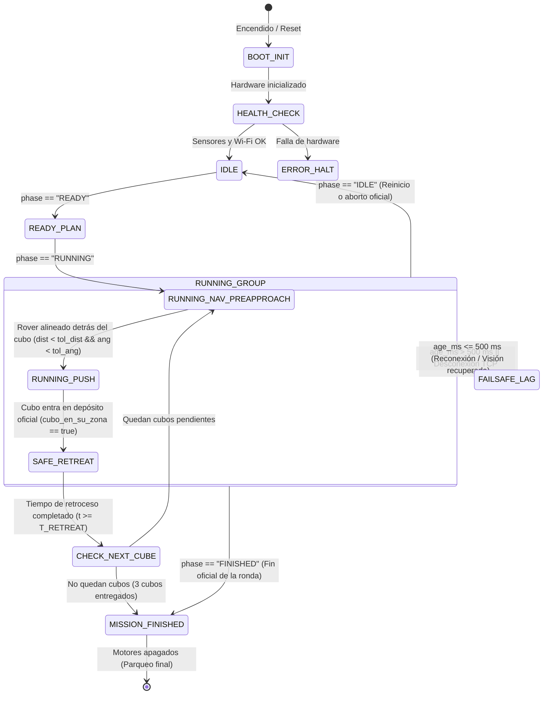

# Máquina de Estados Finitos (FSM) del Rover

Este documento describe formalmente la Máquina de Estados Finitos (**FSM**) que gobierna el comportamiento autónomo del rover (CenfoBot / ESP32) para el **Vision Rover Challenge**, de acuerdo con las especificaciones de [`ALGORITMO.md`](../../ALGORITMO.md) y [`reglamento.md`](../../reglamento.md).

---

## 1. Diagrama de Estados

---

## 2. Descripción de Estados

| Estado | Nombre | Propósito | Motores | LED NeoPixel |
| :--- | :--- | :--- | :--- | :--- |
| `0` | **`BOOT_INIT`** | Inicialización de pines PWM, I2C, UART, FreeRTOS y Wi-Fi. | Apagados (`0, 0`) | Blanco (`255, 255, 255`) |
| `1` | **`HEALTH_CHECK`** | Autodiagnóstico de sensores (IMU, Sonar, IR, nivel de batería). | Apagados (`0, 0`) | Amarillo parpadeante |
| `2` | **`IDLE`** | Enlace TCP activo a `VISION_PORT 2026`. Espera pasiva de la señal oficial de inicio. | Apagados (`0, 0`) | Azul fijo (`0, 0, 255`) |
| `3` | **`READY_PLAN`** | La visión cambió a `READY`. El rover analiza la escena, selecciona el cubo objetivo y calcula la trayectoria. | Apagados (`0, 0`) | Cian fijo (`0, 255, 255`) |
| `4` | **`NAV_PREAPPROACH`** | Navega hacia el punto de pre-aproximación situado detrás del cubo, alineado con el vector cubo $\rightarrow$ acopio. | Activos (PID de rumbo) | Verde parpadeante |
| `5` | **`PUSH_TO_DEPOT`** | Empuja el cubo en línea recta hacia el depósito del color correspondiente, monitoreando el estado del cubo. | Activos (Avance controlado) | Verde fijo (`0, 255, 0`) |
| `6` | **`SAFE_RETREAT`** | Maniobra de reversa en curva para separarse del depósito sin que las aletas laterales arrastren el cubo fuera. | Reversa curvada ($v_L \neq v_R$) | Magenta (`255, 0, 255`) |
| `7` | **`CHECK_NEXT_CUBE`**| Evalúa si aún hay cubos fuera de sus zonas. Si hay, selecciona el siguiente; si no, finaliza. | Apagados (`0, 0`) | Amarillo fijo |
| `8` | **`MISSION_FINISHED`**| Misión completada exitosamente. El rover frena y permanece estacionado. | Apagados (`0, 0`) | Arcoíris / Verde pulsante |
| `9` | **`FAILSAFE_LAG`** | Activación de seguridad por pérdida de visión (`age_ms > 500`) o corte de conexión TCP. | **Freno inmediato** (`0, 0`) | Rojo parpadeante (`255, 0, 0`) |

---

## 3. Matriz Detallada de Transiciones

### 3.1. `IDLE` $\rightarrow$ `READY_PLAN`
* **Condición de activación:** Mensaje de telemetría recibido con `phase == "READY"`.
* **Acciones en la transición:**
  1. Identificar la posición actual del propio rover (`ROVER_ID`).
  2. Evaluar los 3 cubos disponibles en la telemetría (`red`, `green`, `blue`).
  3. Filtrar cubos que ya se encuentren dentro de su respectivo depósito según `cubo_en_su_zona()`.
  4. Seleccionar el cubo objetivo (en modo 1 rover: el más cercano; en modo 2 rovers: según asignación de costo).
  5. Calcular el punto de pre-aproximación $\vec{P}_{pre}$ y verificar mitigación de bordes si el cubo está a $< 5\text{ cm}$ de la orilla.

### 3.2. `READY_PLAN` $\rightarrow$ `NAV_PREAPPROACH`
* **Condición de activación:** Mensaje de telemetría recibido con `phase == "RUNNING"`.
* **Acciones en la transición:**
  1. Iniciar temporizador de ejecución.
  2. Activar bucle de control de rumbo y velocidad hacia el objetivo $\vec{P}_{pre}$.

### 3.3. `NAV_PREAPPROACH` $\rightarrow$ `PUSH_TO_DEPOT`
* **Condición de activación:**
  $$\|\vec{P}_{rover} - \vec{P}_{pre}\| < \epsilon_{dist} \quad \text{y} \quad |\Delta\theta| < \epsilon_{ang}$$
  donde $\epsilon_{dist} = 1.0\text{ celda}$ ($2\text{ cm}$) y $\epsilon_{ang} = 15^\circ$.
* **Confirmación complementaria (Fase 3.2 de ALGORITMO.md):**
  - Sensor ultrasónico detecta obstáculo a $< 10\text{ cm}$.
  - El rover se encuentra en posición frontal al cubo respecto a la zona de acopio.
* **Acciones en la transición:**
  1. Cambiar referencia de objetivo al centro del depósito del color correspondiente: $\vec{P}_{depot}$.
  2. Ajustar velocidad a velocidad de empuje ($v_{push} \approx 0.45$).

### 3.4. `PUSH_TO_DEPOT` $\rightarrow$ `SAFE_RETREAT`
* **Condición de activación:**
  `cubo_en_su_zona(cubo_objetivo, depot, depot_size, grid, cube_side) == true`
  (evaluado tanto por la telemetría de visión global como por verificación de coordenadas en el ESP32).
* **Acciones en la transición:**
  1. Detener avance hacia adelante.
  2. Guardar timestamp de inicio de retroceso $t_{retreat\_start} = \text{millis}()$.
  3. Aplicar velocidades asimétricas en reversa ($v_{left} = -0.40, v_{right} = -0.25$) para describir una trayectoria circular hacia atrás.

### 3.5. `SAFE_RETREAT` $\rightarrow$ `CHECK_NEXT_CUBE`
* **Condición de activación:**
  $$t - t_{retreat\_start} \ge T_{retreat\_duration} \quad (\approx 1.2\text{ s})$$
  y distancia del rover al centro del depósito $> 6\text{ celdas}$.
* **Acciones en la transición:**
  1. Detener motores (`0, 0`).
  2. Marcar el cubo actual como completado en la lista interna.

### 3.6. `CHECK_NEXT_CUBE` $\rightarrow$ `NAV_PREAPPROACH` vs `MISSION_FINISHED`
* **Condición de activación A (quedan cubos):** Existe al menos un cubo cuyo `cubo_en_su_zona == false`.
  - Acción: Seleccionar el nuevo cubo objetivo, calcular su $\vec{P}_{pre}$ y retornar a `NAV_PREAPPROACH`.
* **Condición de activación B (todos completados):** Los 3 cubos están en sus depósitos o el tiempo límite está por vencer.
  - Acción: Transicionar a `MISSION_FINISHED`, apagar motores y colocar LED en verde/arcoíris.

---

## 4. Watchdogs de Seguridad y Failsafe

### 4.1. Watchdog de Antigüedad de Telemetría (`age_ms > 500`)
* **Regla:** Si en cualquier estado de movimiento (`NAV_PREAPPROACH`, `PUSH_TO_DEPOT`, `SAFE_RETREAT`), el campo `age_ms` del propio rover o del cubo objetivo supera **500 ms**, o no se reciben paquetes TCP durante más de 500 ms:
  1. La FSM fuerza la entrada inmediata al estado `FAILSAFE_LAG`.
  2. Se cortan de inmediato ambos motores (`throttle = 0.0`).
  3. El LED cambia a Rojo parpadeante.
* **Recuperación:** Tan pronto como se reciba un frame válido con `age_ms <= 500`, el sistema reanuda el estado en el que se encontraba sin perder la planificación.

### 4.2. Watchdog de Atascamiento (*Stall Detection*)
* **Regla:** Si los motores están empujando ($v > 0.3$) durante más de 3.0 segundos y la posición del rover medida por la visión no cambia más de 0.5 celdas (1 cm):
  - El robot ejecuta una pequeña reversa de 0.5 s para desatascarse y recalcula el ángulo de ataque.
